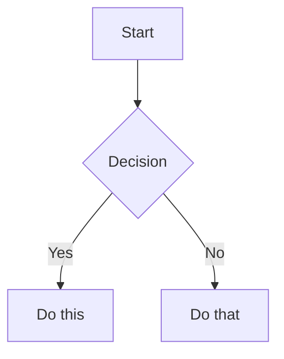

# Obsidian Flavored Markdown Skill

> Third-party attribution: This content includes material derived from
> kepano/obsidian-skills. See THIRD_PARTY_NOTICES.md.

Create and edit valid Obsidian Flavored Markdown. Covers only Obsidian-specific extensions — standard Markdown (headings, bold, italic, lists, quotes, code blocks, tables) is assumed knowledge.

## Workflow: Creating an Obsidian Note

1. **Add frontmatter** with properties (type, date, tags, aliases) at the top of the file.
2. **Write content** using standard Markdown plus Obsidian-specific syntax below.
3. **Link related notes** using wikilinks (`[[Note]]`) for internal vault connections.
4. **Embed content** from other notes, images, or PDFs using `![[embed]]` syntax.
5. **Add callouts** for highlighted information using `> [!type]` syntax.
6. Verify the note renders correctly in Obsidian's reading view.

> Use `[[wikilinks]]` for notes within the vault (Obsidian tracks renames automatically)
> and `[text](url)` for external URLs only.

## Internal Links (Wikilinks)

```markdown
[[Note Name]]                          Link to note
[[Note Name|Display Text]]             Custom display text
[[Note Name#Heading]]                  Link to heading
[[Note Name#^block-id]]                Link to block
[[#Heading in same note]]              Same-note heading link
```

Define a block ID by appending `^block-id` to any paragraph:

```markdown
This paragraph can be linked to. ^my-block-id
```

## Embeds

Prefix any wikilink with `!` to embed its content inline:

```markdown
![[Note Name]]                         Embed full note
![[Note Name#Heading]]                 Embed section
![[image.png]]                         Embed image
![[image.png|300]]                     Embed image with width
![[document.pdf#page=3]]               Embed PDF page
```

## Callouts

```markdown
> [!note]
> Basic callout.

> [!warning] Custom Title
> Callout with a custom title.

> [!faq]- Collapsed by default
> Foldable callout (- collapsed, + expanded).
```

Common types: `note`, `tip`, `warning`, `info`, `example`, `quote`, `bug`, `danger`,
`success`, `failure`, `question`, `abstract`, `todo`, `important`.

## Properties (Frontmatter)

```yaml
---
type: daily | weekly | monthly | project | reference | clipping | idea
date: 2024-01-15
tags:
  - project
  - active
aliases:
  - Alternative Name
cssclasses:
  - custom-class
---
```

## Tags

```markdown
#tag                    Inline tag
#nested/tag             Nested tag with hierarchy
```

Tags can also be defined in frontmatter under the `tags` property.

## Comments

```markdown
This is visible %%but this is hidden%% text.

%%
This entire block is hidden in reading view.
%%
```

## Obsidian-Specific Formatting

```markdown
==Highlighted text==                   Highlight syntax
```

## Math (LaTeX)

```markdown
Inline: $e^{i\pi} + 1 = 0$

Block:
$$
\frac{a}{b} = c
$$
```

## Diagrams (Mermaid)

````markdown

````

## Footnotes

```markdown
Text with a footnote[^1].

[^1]: Footnote content.

Inline footnote.^[This is inline.]
```

## Complete Example

```markdown
---
type: project
status: active
review: 2024-01-30
tags:
  - project
  - active
---

# Project Alpha

This project aims to [[improve workflow]] using modern techniques.

> [!important] Key Deadline
> The first milestone is due on ==January 30th==.

## Next actions

- [x] Initial planning
- [ ] Development phase
  - [ ] Backend implementation
  - [ ] Frontend design

## Related notes

- [[Weekly/README]]
- [[References/Algorithm Notes#Sorting]]
```

## References

- [Obsidian Flavored Markdown](https://help.obsidian.md/obsidian-flavored-markdown)
- [Internal links](https://help.obsidian.md/links)
- [Callouts](https://help.obsidian.md/callouts)
- [Properties](https://help.obsidian.md/properties)
